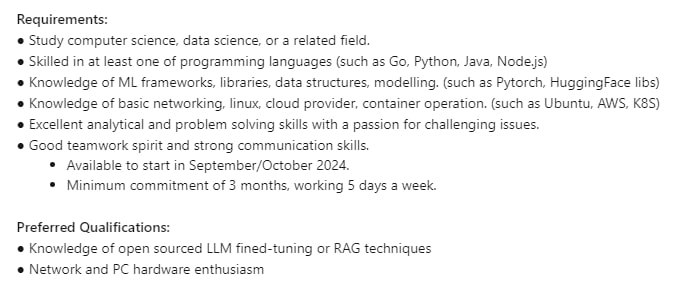

Working at Tencent was really enriching & I chanced upon this listing for an ML SRE so I applied & went through the interview pipeline once again!

Decided to do this part-time during Term 7 (SUTD goes by trimesters!) too because I've been learning infinitely more in industry roles than in school so why not right.

There I began what I called Project Dora II for lack of a better name (and some semblance of continuity from wanting to contribute more previously). This one was a lot more tooling than observability.

Supervisor offered many tasks, so I took them in stride.

First, I worked on containerising LLMs for finetuning and inference for downstream tasks, reducing toil in the form of initialisation overhead by approx. 30%. This allowed colleagues to place more time into actual development work and took the manual & repetitive nature of setting up away.

Later, I built a platform on Linux with multi-GPU support and custom kernels for the research team. Previously they were running ML scripts on their terminal, so this was quite a big QOL change and step up in efficiency. This one was difficult as the learning curve was steep, but learnt a lot in this experience about stuff like sharding & data parallelism.

*P.S. no images! mostly sensitive information here*